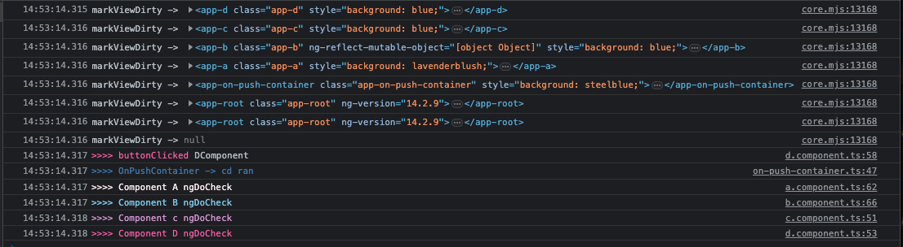

https://courses.indepth.dev/angular/optimization-techniques/on-push-strategy

```text
should skip OnPush components in update mode when they are not dirty
should not check OnPush components in update mode when parent events occur

should check OnPush components on initialization
should call doCheck even when OnPush components are not dirty

should check OnPush components in update mode when inputs change
should check OnPush components in update mode when component events occur
should check parent OnPush components in update mode when child events occur
should check parent OnPush components when child directive on a template emits event
```
* Can probably write small examples for the above and also for

* _Keep in mind that ngDoCheck is triggered only for top-most child component. If the component has children, and Angular doesn't check this component, ngDoCheck is not triggered for them._

<br/>

* We can put a breakpoint on `markViewDirty(` to see the components that get marked as dirty 

* We can also monkey patch `..node_modules/@angular/core/fesm2020/core.mjs` with a log
([core.mjs](node_modules/@angular/core/fesm2020/core.mjs))

* We need to delete the `.angular` folder for changes to be applied

* `detectChangesInternal` runs when CD runs

* `refreshView` shows which views are being refreshed in a CD run

* `markDirtyIfOnPush` is called when in a parent an input binding for a child is changed. This marks the child as dirty to continue the CD run downwards.


* Even IF all our components are `OnPush`, eimitting and handling an event in a nested component will mark as dirty all of its ancesstors, as can be seen below. The buttonClick occured in `DComponent`



# Running outside zone

* Interestingly, using the `ClickZonelessDirective` still marks views as dirty, whereas the listener set up within the component does not


# Life Cycle Hooks
* Most lifecycle hooks are called on the child component while Angular runs change detection for the current component
* The behavior is a bit different only for the ngAfterViewChecked hook

```
Entering view: A
    B: updateBinding
    B: ngOnChanges
    B: ngDoCheck
        A: updateTemplate
    B: ngAfterContentChecked
    Entering view: B
        С: updateBinding
        C: ngOnChanges
        С: ngDoCheck
            B: updateTemplate
        С: ngAfterContentChecked
        Entering view: C
            С: updateTemplate
            С: ngAfterViewChecked
    B: ngAfterViewChecked
A: ngAfterViewChecked
```
